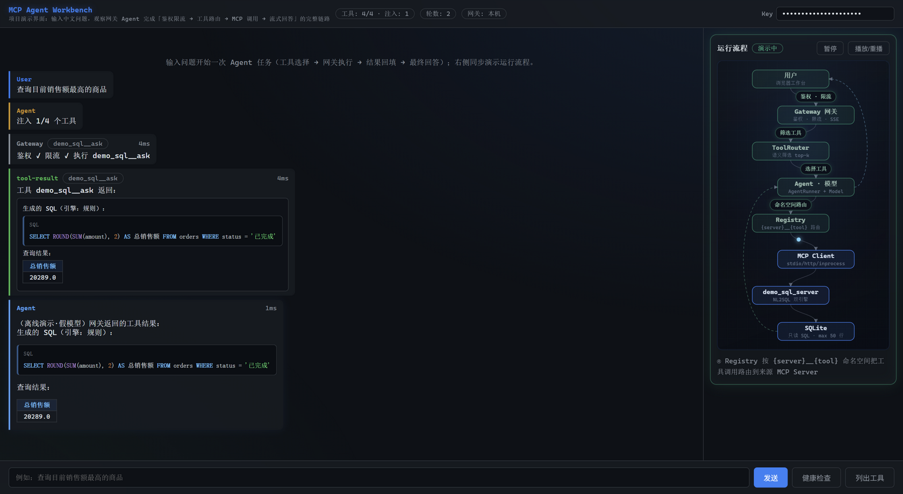

# MCP Gateway — 智能体工具网关

[](https://www.python.org/)
[](https://fastapi.tiangolo.com/)
[](https://modelcontextprotocol.io/)
[](.github/workflows/ci.yml)
[](.github/workflows/ci.yml)
[](LICENSE)

**统一接入并管理多个 MCP Server 的智能体网关**：上层 LLM Agent / 业务系统只对接网关一个入口，即可调用背后任意多个 MCP Server 的工具；鉴权、限流、语义工具路由、流式输出、可观测与断线自愈全程覆盖。

## 在线体验

**https://mcpgatewaydemo1.vercel.app/ui**

- 打开即用：右上角填入演示 Key `dev-key-please-change`，输入中文问题（如「查询目前销售额最高的商品」），观察完整的 **Agent 工具选择 → 网关鉴权限流 → MCP 调用 → 结果回填 → 流式回答** 链路时间线，右侧同步演示网关运行流程动画。
- Serverless 部署（demo server 进程内加载，冷启动 1–3 秒属正常）；`*.vercel.app` 在中国大陆受 DNS 污染可能无法直连，海外网络或 GitHub Actions（`demo-health` workflow）可直接验收。



## 它解决什么问题

| 场景痛点 | 网关的答案 |
|---|---|
| 工具越来越多，全量塞进 Agent 上下文 → token 膨胀、选择质量下降 | 语义工具路由：按查询只注入 top-k 相关工具 |
| 多个调用方共享工具 → 无隔离、无配额 | API Key 鉴权 + 令牌桶限流 + 租户/工具白名单 |
| 下游 MCP Server 宕机 → 整个入口不可用 | 指数退避自动重连，恢复后工具自动重新注册 |
| AI 调用过程是黑盒，用户看不见 | 步骤 Trace + SSE 流式 + 可视化工作台 |

## 核心特性

- **四种传输接入**：stdio（本地子进程）/ SSE / Streamable HTTP / inprocess（进程内加载，Serverless 友好）
- **工具注册中心**：`{server}__{tool}` 命名空间全局唯一（兼容 OpenAI function calling 命名规则）、并发连接、单点失败不阻塞
- **语义工具路由**：中文 2-gram 切分 + 名称/描述/参数加权打分，`GET /tools?query=销售额&top_k=2`；Scorer 为 Protocol 抽象，可平滑升级 embedding
- **网关内 Agent**：`POST /agent/run` 完整 Agent 循环（工具路由 → 模型决策 → 网关执行 → 结果回填 → 最终回答），`Model` Protocol 可插拔（OpenAI 兼容端点 / MockModel 离线演示）
- **SSE 流式**：`POST /agent/run/stream`（`step → token* → done`）与 `POST /tools/{name}/call/stream`（`start → result → done`），线上实测不被 Serverless 缓冲
- **NL2SQL 双引擎**：13 条规则模板兜底 + 可选 LLM 增强（`rule / llm / hybrid` 三模式，LLM 不可用自动降级，结果标注引擎来源）
- **安全与多租户**：API Key 鉴权（SQLite 存储，`APIKeyStore` Protocol 可换 Redis/PostgreSQL）、令牌桶限流（429 + `Retry-After`）、tenant + 工具白名单（403/404 语义区分）
- **可靠性**：失败 Server 指数退避自动重连（2s→60s）、`asyncio.timeout` 调用总超时（502 明确提示）、`classify_error` 按 MCP SDK 错误码分类（识别 `-32000` 断连 / `-32001` 超时）
- **可观测**：structlog 结构化 JSON 日志 + Prometheus 指标（工具调用次数/耗时，按 tool/server/status 维度）
- **交互工作台 `/ui`**：纯静态三件套（零构建链、零 CDN），调用链时间线 + SQL 高亮/表格富渲染 + 运行流程 SVG 动画

## 快速开始

```bash
uv sync                                   # 安装依赖（自动准备 Python 3.12）
uv run uvicorn app.main:app --reload      # 启动开发服务器（默认 stdio 拉起 demo server）
uv run pytest                             # 运行测试
uv run ruff check .                       # lint

docker compose up --build                 # Docker 双容器部署（gateway + demo_sql）
```

常用接口：

```bash
KEY="dev-key-please-change"   # 演示 Key，见 config/gateway.yaml

curl http://localhost:8000/health
curl -H "X-API-Key: $KEY" "http://localhost:8000/tools?query=销售额&top_k=2"

curl -X POST http://localhost:8000/agent/run -H "X-API-Key: $KEY" \
     -H "Content-Type: application/json" -d '{"question": "有多少客户？"}'

curl -N -X POST http://localhost:8000/tools/demo_sql__ask/call/stream \
     -H "X-API-Key: $KEY" -H "Content-Type: application/json" \
     -d '{"arguments": {"question": "有多少客户？"}}'    # SSE: start → result → done
```

`demo_sql_server` 内置迷你电商库（customers / products / orders），提供 4 个工具：
`ask`（中文提问 → 自动生成并执行只读 SQL）、`run_sql`（直接执行只读 SQL）、
`list_tables`（表结构）、`echo`（链路调试）。只读校验（仅 SELECT/WITH、危险关键字拦截、
50 行截断）在工具层强制执行。接入新的 MCP Server 只需在 `config/gateway.yaml` 声明，无需改代码。

## Agent 调用示例（examples/）

演示「LLM Agent → 网关 → MCP Server」完整闭环，Agent 不直连任何 MCP Server，
只通过网关统一 REST API 调用聚合工具：

```bash
uv run uvicorn app.main:app                                    # 先启动网关
uv run python examples/openai_agent.py "有多少客户？" --mock    # 离线演示（假模型，无需 API Key）
uv run python examples/openai_agent.py "总销售额是多少？"        # 真实 OpenAI function calling
uv run --group agent python examples/langchain_agent.py "有多少客户？"  # LangChain 版
```

两个版本：`openai_agent.py`（纯 httpx 手写 function-calling 协议，`OPENAI_BASE_URL`
可指向 One-API / Ollama / DeepSeek 等兼容端点）、`langchain_agent.py`（网关工具
动态包装成 LangChain Tools）。详见 `examples/README.md`。

## 架构

```
                      ┌──────────────────────────────────┐
                      │  Interactive Agent Workbench /ui  │
                      └──────────────┬───────────────────┘
                                     │ REST + SSE
                      ┌──────────────▼───────────────────┐
                      │          Gateway (FastAPI)        │
                      │  鉴权(401) → 限流(429) → 白名单(403) │
                      │  app/agent/    AgentRunner + Model │
                      │  app/mcp/      ToolRouter + Registry│
                      │  四传输 client + 断线自愈 + 总超时    │
                      │  structlog 日志 + Prometheus 指标    │
                      └───────┬────────────┬──────────────┘
                      stdio/inprocess      ├── http / sse
              ┌───────────────▼──┐  ┌──────▼─────────────┐
              │ demo_sql_server  │  │ 其他 MCP Server(任意)│
              │ NL2SQL 双引擎     │  └────────────────────┘
              └──────────────────┘
```

## 设计决策与踩坑（ADR）

1. **Vercel Serverless 拉不起 MCP 子进程**（子进程解释器看不到构建期依赖，工具注册数为 0）→ 新增 `inprocess` 传输，在网关进程内直接加载 `MCPServer` 实例；本地 stdio / Docker HTTP 不受影响。*部署环境倒逼传输层抽象。*
2. **MCP SDK 2.0.0 的 `streamable_http_client` 只 yield 2 元组**（旧教程为 3 元组），该缺陷潜伏到 Docker 冒烟才暴露 → 以实装 SDK 为准适配，并补独立 http 子进程集成测试。*集成测试兜住 SDK 版本差异。*
3. **SDK 2.x 把对端断连包装成 `MCPError(-32000)`**，不是 Python `ConnectionError`——按传统异常类型判断会漏判、自愈不触发 → `classify_error()` 按 SDK 错误码分类（`-32000` 断连 / `-32001` 读超时）。*自愈闭环的最后一公里。*
4. **`*.vercel.app` 大陆 DNS 污染**无法自验线上 → 用 GitHub Actions `demo-health` workflow 从海外 Runner 跑 4 步验收。*工程闭环不依赖本地网络。*

## 配置

`config/gateway.yaml`（优先级：代码默认值 < YAML < 环境变量 `GATEWAY_*`）：

```yaml
gateway:
  port: 8000
  tool_call_timeout: 30.0     # 单次工具调用总时长兜底
auth:                          # API Key 鉴权（SQLite 存储，启动种子写入）
  api_keys:
    - { key: dev-key-please-change, name: demo, tenant: demo, rate_limit_per_minute: 60 }
    - { key: limited-tools-key, name: limited-tools, tenant: demo,
        rate_limit_per_minute: 60, allowed_tools: ["demo_sql__ask"] }   # 白名单演示
routing:                       # 语义工具路由
  { enabled: true, top_k: 10, min_tools: 3 }
agent:                         # 网关内 Agent（mock 开箱即用；真实模型配 GATEWAY_AGENT_API_KEY）
  { enabled: true, mock: true, model: gpt-4o-mini, max_rounds: 8 }
servers:                       # MCP Server 声明式接入，无需改代码
  - name: demo_sql
    transport: stdio           # stdio / sse / http / inprocess
    command: python
    args: ["servers/demo_sql_server/server.py"]
```

Docker Compose 使用 `config/gateway.docker.yaml`：demo_sql 以独立容器跑
Streamable HTTP，网关经 `http://demo_sql:9001/mcp` 连接。

## 测试与质量

- **156 项测试**（`uv run pytest`）：stdio/SSE/HTTP 真实子进程集成测试、inprocess 加载 Vercel 生产配置回归测试、kill 下游 Server 后自动恢复的故障注入测试
- `ruff check` + `ruff format --check` 全过；GitHub Actions 在 push / PR 时执行 `uv sync --locked` + Ruff + pytest
- 兼容红线：`/tools`、`/tools/{name}/call`、`/servers` 等公开契约只做增量扩展；examples/ 与网关双向无依赖

## 项目结构

```
app/
├── main.py          FastAPI 入口（lifespan：registry / key_store / rate_limiter / agent）
├── config.py        配置中心（默认值 < YAML < 环境变量）
├── core/            security / rate_limit / logging / metrics
├── mcp/             transports · client · registry · tool_router · schemas
├── agent/           AgentRunner · Model Protocol（OpenAI 兼容 / Mock）
├── api/             deps.py 依赖注入 + routes/（tools · servers · agent · health）
├── schemas/         Pydantic 请求/响应模型
└── ui/              浏览器工作台（纯静态 HTML/CSS/JS）
servers/demo_sql_server/   示例 MCP Server（4 工具，NL2SQL 双引擎，只读校验）
examples/                  OpenAI function-calling 与 LangChain 调用网关的 Agent 示例
tests/                     与 app 结构对应的单元/集成测试
config/                    本地 stdio / Docker http / Vercel inprocess 三套配置
```

## Roadmap

- [x] 四传输 MCP 接入 + 工具注册中心 + 统一 REST API + 鉴权限流 + 可观测
- [x] 语义工具路由 + 网关内 Agent + /ui 工作台 + SSE 流式
- [x] NL2SQL 双引擎（规则 + LLM）+ 多租户/工具白名单 + 断线自愈/总超时/错误分类
- [ ] embedding 语义路由（Scorer 已预留接口）
- [ ] Redis 分布式限流 + Key 哈希存储
- [ ] OpenTelemetry 链路追踪 / 压测报告

## License

[MIT](LICENSE)
